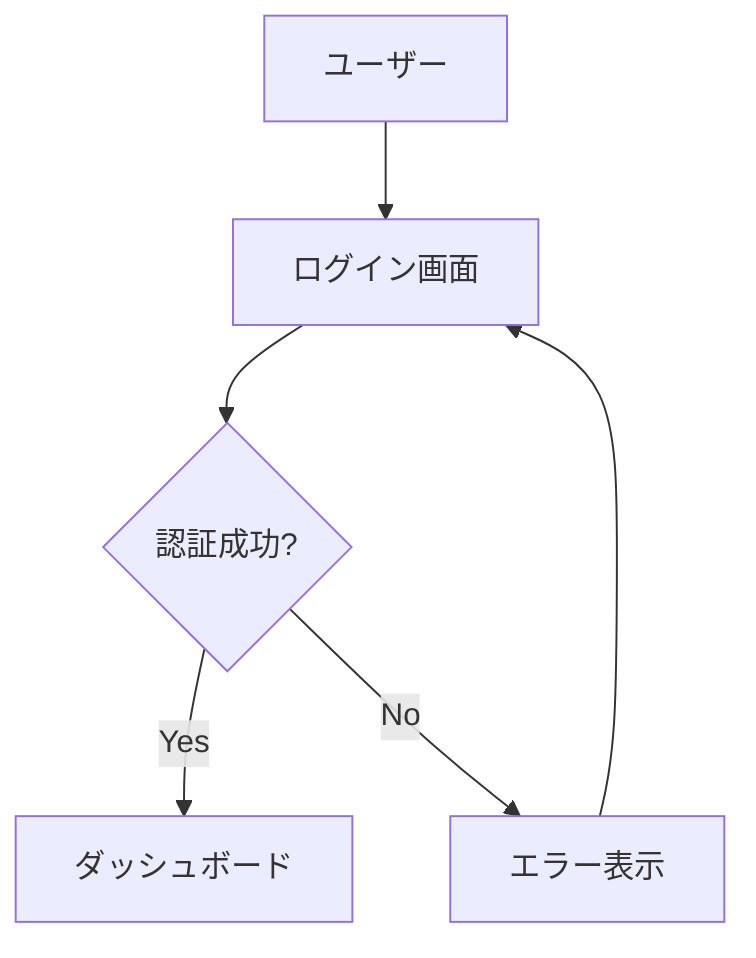
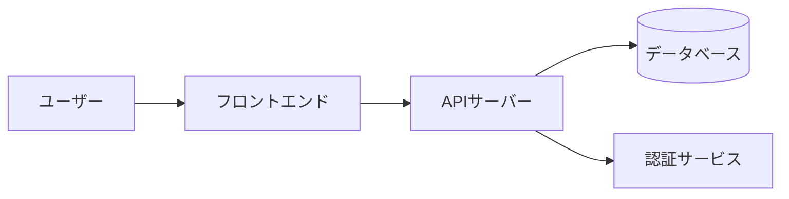
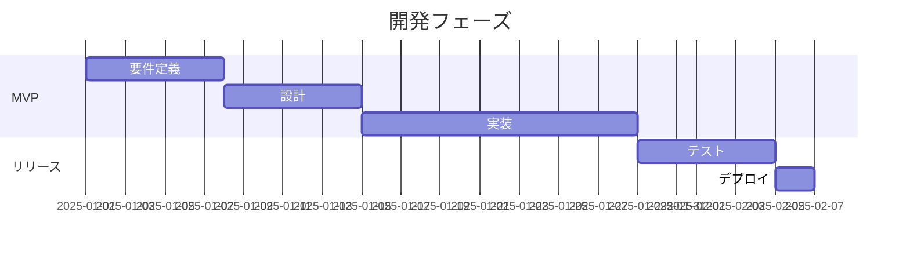
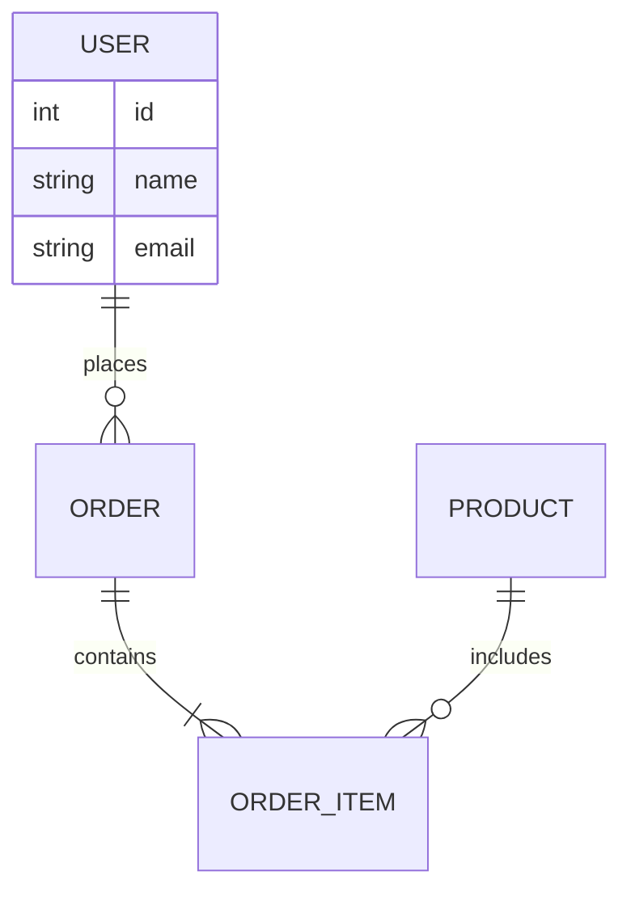
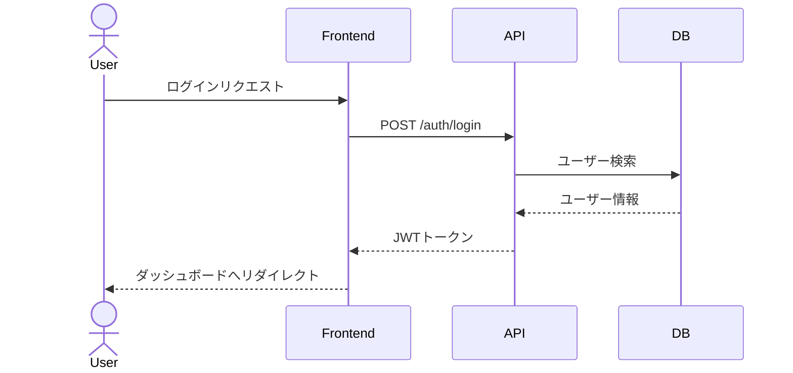

# 要件作成・整理スキル

## 概要

ユーザーの要求・アイデア・課題を分析し、実装可能な要件として構造化する。
曖昧さを排除し、開発チームがそのまま着手できる粒度まで分解する。

## 実行手順

### Step 1: 要求の収集・理解

引数として渡された要求を分析する。ファイルパスが指定された場合はファイルを読み込む。

- 要求の**主語（誰が）**・**動詞（何をする）**・**目的（なぜ）** を特定する
- 暗黙の前提・制約を洗い出す
- 不明点があれば AskUserQuestion で確認する（1回の呼び出しで最大5問、必要最小限に絞る）

### Step 2: 要件の分類・分解

特定した要求を以下のカテゴリに分類・分解する：

**機能要件 (Functional Requirements)**
- システムが「何をするか」
- ユーザーストーリー形式: `<役割> として、<機能> ができる。なぜなら <理由> だから。`
- 各要件に一意のID（FR-001 など）を付与

**非機能要件 (Non-Functional Requirements)**
- パフォーマンス・セキュリティ・可用性・スケーラビリティ・保守性
- 各要件に計測可能な基準値を設定する（例: レスポンスタイム < 200ms）
- 各要件に一意のID（NFR-001 など）を付与

**制約 (Constraints)**
- 技術スタック・予算・期限・法規制・既存システムとの互換性
- 各制約に一意のID（CON-001 など）を付与

**スコープ外 (Out of Scope)**
- 今回の要件に含めないことを明示する項目

### Step 3: 受け入れ基準の作成

各機能要件に対して Given-When-Then 形式で受け入れ基準を作成する：

```
Given: <前提条件>
When:  <ユーザーのアクション>
Then:  <期待される結果>
```

### Step 4: 優先度付け

MoSCoW 法で各要件に優先度を付ける：

| 優先度 | 意味 |
|--------|------|
| 🔴 **Must Have** | MVP に必須。これがないとリリース不可 |
| 🟡 **Should Have** | 重要だが代替手段がある。次のイテレーションで対応可 |
| 🔵 **Could Have** | あると良い。リソースがあれば対応 |
| ⚪ **Won't Have** | 今回のスコープ外。将来の検討事項 |

### Step 5: 要件ドキュメントのファイル出力

以下のルールで `.md` ファイルとして保存する：

- 出力先: `docs/requirements/` ディレクトリ（なければ作成する）
- ファイル名: `<機能名をケバブケース>-requirements.md`（例: `user-auth-requirements.md`）
- Write ツールでファイルを作成する

**Mermaid 図解の使用基準:**

以下に該当する場合は、テキスト説明に加えて Mermaid 図を挿入する：

| 状況 | 使用する図の種類 |
|------|----------------|
| ユーザーの操作フロー・画面遷移がある | `flowchart TD` |
| 複数のシステム・アクター間の関係がある | `graph LR` |
| 時系列・フェーズ・依存関係がある | `gantt` |
| データ構造・エンティティ関係がある | `erDiagram` |
| ユースケース・アクターが複数いる | `sequenceDiagram` |

**具体例:**

操作フロー (`flowchart TD`):



システム間の関係 (`graph LR`):



時系列・フェーズ (`gantt`):



データ構造 (`erDiagram`):



複数アクターのやり取り (`sequenceDiagram`):



下記フォーマットで要件を出力する。

---

## 出力フォーマット

出力ファイルのパス: `docs/requirements/<機能名をケバブケース>-requirements.md`

以下の構造で `.md` ファイルを作成する。

---

### テンプレート

**ファイル先頭:**

```
# 要件定義: <プロジェクト/機能名>

作成日: YYYY-MM-DD
バージョン: 1.0
ステータス: Draft
```

**背景・目的セクション:**

要求の背景と解決したい課題を2〜3文で記述する。フロー・遷移・関係性がある場合は Mermaid 図を挿入する（flowchart TD / graph LR / sequenceDiagram など）。

**機能要件セクション:**

MoSCoW の優先度ごとに見出しを分けて記述する。各要件の形式：

```
#### [FR-001] <要件名>
- ユーザーストーリー: <役割> として、<機能> ができる。なぜなら <理由> だから。
- 受け入れ基準:
  - Given: <前提条件>
  - When: <アクション>
  - Then: <期待結果>
- 優先度: Must Have / Should Have / Could Have / Won't Have
```

**非機能要件セクション:**

```
#### [NFR-001] <要件名>
- カテゴリ: パフォーマンス / セキュリティ / 可用性 / 保守性
- 要件: <具体的な要件>
- 計測基準: <数値・条件>
- 優先度: Must Have / Should Have / Could Have
```

**制約セクション:**

```
#### [CON-001] <制約名>
- 内容: <制約の説明>
- 理由: <なぜこの制約があるか>
```

**末尾セクション（スコープ外・未解決事項・サマリー）:**

```
## スコープ外
- <今回対応しない項目>

## 未解決の質問・リスク
- [ ] <確認が必要な事項>
- [ ] <潜在的なリスク>

## 要件サマリー
| カテゴリ   | Must | Should | Could | Won't |
|------------|------|--------|-------|-------|
| 機能要件   | N    | N      | N     | N     |
| 非機能要件 | N    | N      | N     | N     |
```

---

## 注意事項

- 要件は**計測可能・検証可能**な形で記述する（「速い」ではなく「200ms以内」）
- 実装方法（How）ではなく**何を達成するか（What）** にフォーカスする
- 要求が曖昧な場合は推測せず、不明点を明示するか確認を取る
- 既存のコードベースがある場合は現状の制約を考慮する
- 要件の数が多い場合はサブエージェントを使って並列分析する
- **必ず `.md` ファイルとして `docs/requirements/` に保存する**
- Mermaid 図は「図がないと理解しにくい」場合のみ追加する。簡単な要件に無理やり図を入れない
- 要件ドキュメント作成後は `/create-tasks` スキルで実装タスクに分解することを推奨する
