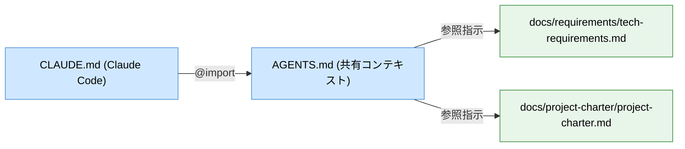

# 技術要件ヒアリング・プロジェクト憲章作成スキル

## 概要

プロジェクト立ち上げ時のキックオフヒアリングを行い、以下の3つの成果物を生成する：

1. **技術要件ドキュメント** — 機能要件・非機能要件・技術スタック・制約を構造化
2. **プロジェクト憲章** — 目標・スコープ・マイルストーン・リスクをまとめた承認文書
3. **`AGENTS.md` への反映** — 両ツールで共有できるコンテキスト宣言

詳細な機能要件の深堀りには `/requirements` スキルを後続で使用すること。

---

## 実行手順

### Step 1: 引数の確認

引数（プロジェクト名 or 概要）が渡されている場合はそれを使用する。
渡されていない場合は、ラウンド1の最初の質問でプロジェクト名・概要を確認する。

---

### Step 2: ヒアリング — ラウンド1（プロジェクトの輪郭）

AskUserQuestion を使い、以下の質問を **一度にまとめて** 提示する（最大5問）。

```
1. このプロジェクトが解決したい問題、または達成したいゴールは何ですか？
2. 主な利用者（エンドユーザー）は誰で、想定規模（人数・リクエスト数など）はどのくらいですか？
3. MVP として最低限必要な機能を箇条書きで教えてください。
4. 既存システムや引き継ぐ資産（コード・DB・インフラ・API）はありますか？
5. 大まかなリリース目標時期はありますか？（例：3ヶ月後、2025年Q3 など）
```

回答を受け取ったら、内容を内部的にサマリーとして保持し、ラウンド2へ進む。

---

### Step 3: ヒアリング — ラウンド2（技術スタックと制約）

AskUserQuestion を使い、以下の質問を **一度にまとめて** 提示する（最大5問）。
**ラウンド1の回答内容を踏まえて質問を調整する**（例：個人情報を扱うと分かればセキュリティ要件を深掘りする）。

```
1. 使用言語・フレームワーク・クラウドの希望または制約はありますか？（例：TypeScript + Next.js + AWS、制約なし など）
2. チーム構成を教えてください。（人数・役割・経験レベルの概要）
3. セキュリティ・コンプライアンス要件はありますか？（個人情報取扱い、業界規制、認証要件など）
4. 予算・ライセンス・外部サービス利用に関する制約はありますか？
5. パフォーマンス目標はありますか？（例：API レスポンス < 200ms、同時接続 1000 ユーザーなど）
```

---

### Step 4: ヒアリング — ラウンド3（成功基準・リスク）

ラウンド1・2の回答が **十分に詳細** であれば、ユーザーに「このまま文書化フェーズへ進んでもよいですか？それとも成功基準・リスクについてもヒアリングしますか？」と確認する。

進める場合は以下を AskUserQuestion で提示する。

```
1. このプロジェクトが「成功した」と判断する基準は何ですか？（定量的な指標があれば尚良い）
2. 現時点で最も懸念しているリスクや不確実性は何ですか？
3. ステークホルダー（承認者・関係部署・外部パートナー）の構成を教えてください。
```

---

### Step 5: ヒアリング結果のサマリー確認

ヒアリング内容を以下の形式でユーザーに提示し、確認を求める。

```
## ヒアリング結果サマリー

**プロジェクト名**: <名前>
**ゴール**: <1〜2文>
**対象ユーザー**: <説明>
**MVP機能**: <箇条書き>
**技術スタック**: <言語/FW/DB/インフラ>
**リリース目標**: <時期>
**主な制約**: <箇条書き>
**成功基準**: <箇条書き>
**主なリスク**: <箇条書き>

この理解で文書化フェーズへ進んでもよいですか？修正があれば教えてください。
```

修正があれば反映してからステップ6へ進む。

---

### Step 6: 技術要件ドキュメントの生成・保存

出力先: `docs/requirements/<project-name>-tech-requirements.md`（ディレクトリがなければ作成）

**Mermaid 図の使用基準:**

| 状況 | 使用する図の種類 |
|------|----------------|
| 複数システム・コンポーネント間の関係がある | `graph LR` |
| 複数アクター間のリクエストフローがある | `sequenceDiagram` |
| ユーザーの操作フローがある | `flowchart TD` |
| データ構造・エンティティ関係がある | `erDiagram` |

以下のフォーマットで `.md` ファイルを Write で作成する。

---

#### 技術要件ドキュメント テンプレート

```markdown
# 技術要件: <プロジェクト名>

作成日: YYYY-MM-DD
バージョン: 1.0
ステータス: Draft

---

## 1. プロジェクト概要

### 解決する問題

<ヒアリング結果から記述>

### ゴール・スコープ

<ヒアリング結果から記述>

### 対象ユーザーと規模

<ヒアリング結果から記述>

---

## 2. 技術スタック

| レイヤー | 採用技術 | 選定理由・制約 |
|----------|----------|----------------|
| フロントエンド | | |
| バックエンド | | |
| データベース | | |
| インフラ / クラウド | | |
| 外部サービス | | |

---

## 3. 機能要件 (Functional Requirements)

> 詳細な要件は `/requirements` スキルで後続作成することを推奨。

### 🔴 Must Have

#### [FR-001] <要件名>
- ユーザーストーリー: <役割> として、<機能> ができる。なぜなら <理由> だから。
- 受け入れ基準:
  - Given: <前提条件>
  - When: <アクション>
  - Then: <期待結果>
- 優先度: Must Have

### 🟡 Should Have

### 🔵 Could Have

---

## 4. 非機能要件 (Non-Functional Requirements)

#### [NFR-001] パフォーマンス
- カテゴリ: パフォーマンス
- 要件: <具体的な要件>
- 計測基準: <数値・条件>
- 優先度: Must Have

#### [NFR-002] セキュリティ
- カテゴリ: セキュリティ
- 要件: <具体的な要件>
- 計測基準: <条件>
- 優先度: Must Have

---

## 5. 技術制約 (Constraints)

#### [CON-001] <制約名>
- 内容: <制約の説明>
- 理由: <なぜこの制約があるか>

---

## 6. アーキテクチャ概要

<!-- 複数システム・コンポーネントがある場合のみ図を挿入 -->

---

## 7. スコープ外

- <今回対応しない項目>

---

## 8. 未解決リスク・質問

- [ ] <確認が必要な事項>
- [ ] <潜在的なリスク>

---

## 9. 要件サマリー

| カテゴリ | Must | Should | Could | Won't |
|----------|------|--------|-------|-------|
| 機能要件 | N | N | N | N |
| 非機能要件 | N | N | N | N |
```

---

### Step 7: プロジェクト憲章の生成・保存

出力先: `docs/project-charter/<project-name>-charter.md`（ディレクトリがなければ作成）

マイルストーンが **3つ以上かつ具体的な期日がある** 場合のみ Mermaid gantt を挿入する。期日が不明な場合は表形式にとどめる。

以下のフォーマットで `.md` ファイルを Write で作成する。

---

#### プロジェクト憲章 テンプレート

```markdown
# プロジェクト憲章: <プロジェクト名>

作成日: YYYY-MM-DD
バージョン: 1.0
ステータス: Draft
承認者: （未定）

---

## 1. エグゼクティブサマリー

<プロジェクトの目的・アプローチ・期待効果を3〜5文で記述>

---

## 2. 背景と課題

<現状の問題・ビジネス的背景を記述>

---

## 3. プロジェクト目標（SMART形式）

| 目標 | 測定方法 | 達成期限 |
|------|----------|----------|
| <Specific・Measurable・Achievable・Relevant・Time-bound> | | |

---

## 4. 成功基準

| 指標 | 目標値 | 測定方法 |
|------|--------|----------|
| | | |

---

## 5. スコープ

### In Scope（対象）
- <項目>

### Out of Scope（対象外）
- <項目>

---

## 6. マイルストーン

| フェーズ | 主な成果物 | 目標日 |
|----------|-----------|--------|
| 要件定義 | 要件ドキュメント確定 | |
| 設計 | アーキテクチャ設計書 | |
| 実装 | MVP | |
| テスト・リリース | 本番リリース | |

<!-- マイルストーンが3つ以上かつ具体的な期日がある場合のみ以下を挿入 -->
<!--
```mermaid
gantt
    title 開発スケジュール
    dateFormat  YYYY-MM-DD
    section フェーズ
    要件定義     :a1, YYYY-MM-DD, Nd
    設計         :a2, after a1, Nd
    実装         :a3, after a2, Nd
    テスト       :a4, after a3, Nd
    リリース     :a5, after a4, Nd
```
-->

---

## 7. 予算・リソース概要

| 項目 | 概算 | 備考 |
|------|------|------|
| 開発工数 | | |
| インフラ費用 | | |
| 外部サービス費用 | | |

---

## 8. 主要リスクと対応方針

| リスク | 発生確率 | 影響度 | 対応策 |
|--------|----------|--------|--------|
| | 高/中/低 | 高/中/低 | |

---

## 9. 前提条件・依存関係

- <このプロジェクトが成立するための前提>

---

*参照ドキュメント: docs/requirements/PROJECT_NAME-tech-requirements.md*

---

### Step 8: AI ツール共有コンテキストの反映

共通コンテキストを `AGENTS.md` に集約し、Claude Code は `CLAUDE.md` で `@AGENTS.md` としてインポートする。



> **重要**: `AGENTS.md` と `CLAUDE.md` はワークスペース全体に影響するため、必ずユーザーの承認を得てから書き込む。

---

#### 8-1. `AGENTS.md` への反映（GitHub Copilot / OpenAI Codex 用）

2ファイルを参照するよう **テキストで指示** する。

追記するコンテンツ:

```markdown
## プロジェクトコンテキスト

このプロジェクトの規約・技術スタック・アーキテクチャ方針は以下のファイルに定義されています。
コードを生成・編集する際は必ずこれらのファイルを読み込んで規約に従ってください。

- `docs/requirements/<project-name>-tech-requirements.md`
- `docs/project-charter/<project-name>-charter.md`
```

手順:
- `AGENTS.md` が存在する場合: Read して末尾に追記する（Edit）
- 存在しない場合: リポジトリルートに新規作成する（Write）

複数プロジェクトが混在する場合は `## プロジェクト: <name>` 見出しで分割する。

---

#### 8-2. `CLAUDE.md` への反映（Claude Code 用）

Claude Code は `AGENTS.md` を直接読まないため、`CLAUDE.md` で `@AGENTS.md` としてインポートする。

追記するコンテンツ:

```markdown
@AGENTS.md
```

手順:
- `CLAUDE.md` が存在する場合: Read して末尾に追記する（Edit）
- 存在しない場合: リポジトリルートに新規作成する（Write）

---

### Step 9: 完了報告

生成した成果物のパスを一覧で表示し、次のアクションを提案する。

```
## 生成完了

| 成果物 | パス |
|--------|------|
| 技術要件ドキュメント | docs/requirements/<name>-tech-requirements.md |
| プロジェクト憲章 | docs/project-charter/<name>-charter.md |
| 共有コンテキスト（参照指示） | AGENTS.md |
| Claude Code（@import） | CLAUDE.md |

## 次のステップ（推奨）

- `/requirements <機能名>` — 各機能の詳細な要件定義を行う
- `/create-tasks` — 要件ドキュメントを実装タスクに分解して `tasks/todo.md` に出力する
- 憲章の「承認者」欄を埋め、ステークホルダーのレビューを受ける
- 技術スタックが確定したら `docs/requirements/` 配下のアーキテクチャ図を更新する
```

---

## 注意事項

- 要件は**計測可能・検証可能**な形で記述する（「速い」ではなく「200ms 以内」）
- 実装方法（How）ではなく**何を達成するか（What）** にフォーカスする
- ヒアリングで回答が不十分な場合は推測せず、不明点を `## 8. 未解決リスク・質問` に明示する
- `AGENTS.md`・`CLAUDE.md` への書き込みは**必ずユーザーの承認を得てから**実行する
- プロジェクト憲章の Mermaid gantt は「期日が3つ以上かつ具体的」な場合のみ挿入する
- 詳細な機能要件の作成は `/requirements` スキルで後続実施することを推奨する
- ヒアリングはラウンド1→2→3の順で進め、前の回答を踏まえて質問を調整する
