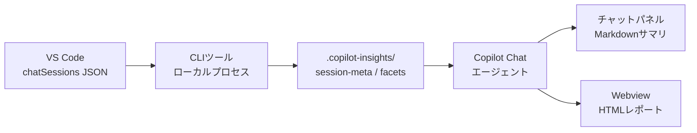

# 要件定義: GitHub Copilot Insights 機能

作成日: 2026-04-16
バージョン: 1.0
ステータス: Draft

---

## 背景・目的

Claude Code の `/insights` コマンド相当の機能を GitHub Copilot 上に実装する。
ユーザーの Copilot 利用状況を分析し、プロンプトの改善やルールファイル（`copilot-instructions.md` 等）への具体的な追記案を提示することが主目的。
利用者は Copilot Chat のワークフローを変えることなく、自身の AI 活用スタイルを継続的に改善できるようになる。

---

## システム概要

---

## 機能要件

### 🔴 Must Have

#### [FR-001] セッション履歴の読み取り
- ユーザーストーリー: Copilot 利用者として、VS Code に保存されたチャット履歴を自動で読み取れる。なぜなら 手動でログを収集する手間をなくしたいから。
- 受け入れ基準:
  - Given: `%AppData%\Code\User\workspaceStorage\{workspaceId}\chatSessions\` に `.jsonl` ファイルが存在する
  - When: CLI ツールをワークスペース内で実行する（またはワークスペースパスを引数で指定する）
  - Then: 実行中ワークスペースのセッションを優先して読み込み、過去 30 日間・最大 50 セッション分の JSONL が正しく解析される。ワークスペース特定不能な場合は全ワークスペースを走査する
- 優先度: Must Have

#### [FR-002] session-meta（定量データ）の抽出
- ユーザーストーリー: Copilot 利用者として、セッションごとの定量メタデータ（メッセージ数・ツール使用回数・行数変化等）を自動算出できる。なぜなら 自分の利用パターンを数値で把握したいから。
- 受け入れ基準:
  - Given: セッション JSON が正しく読み込まれている
  - When: CLI ツールが session-meta 抽出処理を実行する
  - Then: 以下のフィールドを含む JSON が `.copilot-insights/session-meta/` に保存される：`session_id`, `start_time`, `duration_minutes`, `user_message_count`, `tool_counts`, `languages`, `input_tokens`, `output_tokens`, `lines_added`, `lines_removed`, `files_modified`, `tool_errors`, `user_response_times`, `message_hours`
- 優先度: Must Have

#### [FR-003] facets（定性データ）の生成
- ユーザーストーリー: Copilot 利用者として、セッションの目的・成果・摩擦・提案をLLMで自動分析できる。なぜなら 自分では気づきにくいパターンを発見したいから。
- 受け入れ基準:
  - Given: session-meta の抽出が完了しており、LLM API が利用可能である
  - When: CLI ツールが facets 生成処理を実行する
  - Then: `project_area`, `primary_goal`, `session_type`, `inferred_satisfaction`, `wins`, `frictions`, `suggested_rules`, `suggested_patterns` を含む JSON が `.copilot-insights/facets/` に保存される
- 優先度: Must Have

#### [FR-004] Copilot Chat パネルへのサマリ返答
- ユーザーストーリー: Copilot 利用者として、Copilot Chat に特定のコマンドを入力することで分析サマリを Markdown 形式で受け取れる。なぜなら 既存のワークフローを変えずに insights を確認したいから。
- 受け入れ基準:
  - Given: `.copilot-insights/` に中間データが存在する
  - When: ユーザーが Copilot Chat で insights コマンドを実行する
  - Then: 全体統計・利用傾向・改善提案を含む Markdown サマリが Chat パネルに返答される
- 優先度: Must Have

#### [FR-005] Webview による HTML レポート表示
- ユーザーストーリー: Copilot 利用者として、詳細な分析レポートをグラフィカルな HTML 形式で閲覧できる。なぜなら 数値やトレンドを視覚的に把握したいから。
- 受け入れ基準:
  - Given: Copilot Chat のサマリ返答が表示されている
  - When: ユーザーがサマリ内のリンク/ボタンをクリックする
  - Then: VS Code Webview が開き、Claude Code の `/insights` 出力と同等のセクションを持つ HTML レポートが表示される
- 優先度: Must Have

---

### 🟡 Should Have

#### [FR-006] プロジェクト別フィルタリング
- ユーザーストーリー: 複数プロジェクトを持つ利用者として、特定プロジェクトのセッションのみを対象に分析できる。なぜなら プロジェクトごとの傾向を個別に把握したいから。
- 受け入れ基準:
  - Given: 複数の `project_path` を持つセッションが存在する
  - When: ユーザーがプロジェクトを指定して insights コマンドを実行する
  - Then: 指定プロジェクトのセッションのみを対象に分析・表示される
- 優先度: Should Have

#### [FR-007] ルールファイルへの自動追記提案
- ユーザーストーリー: Copilot 利用者として、分析結果から `copilot-instructions.md` への具体的な追記内容を提案してもらえる。なぜなら ルールファイルを継続的に改善したいから。
- 受け入れ基準:
  - Given: facets の `suggested_rules` にルール候補が存在する
  - When: ユーザーが提案を確認する
  - Then: `copilot-instructions.md` に追記すべき具体的なルールテキストと理由が提示される
- 優先度: Should Have

#### [FR-008] 期間指定
- ユーザーストーリー: Copilot 利用者として、分析対象期間（デフォルト 30 日）をカスタマイズできる。なぜなら 直近 1 週間など短期のトレンドを確認したいから。
- 受け入れ基準:
  - Given: CLI ツールが起動している
  - When: ユーザーが `--days 7` 等のオプションを指定する
  - Then: 指定した期間内のセッションのみが分析対象となる
- 優先度: Should Have

---

### 🔵 Could Have

#### [FR-009] 増分更新（差分のみの再分析）
- ユーザーストーリー: Copilot 利用者として、前回の実行以降に追加されたセッションだけを再分析できる。なぜなら LLM API コストと実行時間を削減したいから。
- 受け入れ基準:
  - Given: `.copilot-insights/` に過去の中間データが存在する
  - When: CLI ツールを再実行する
  - Then: 新規セッションのみが LLM 分析の対象となり、既存データは再利用される
- 優先度: Could Have

#### [FR-010] 時系列トレンド表示
- ユーザーストーリー: Copilot 利用者として、週次・月次の利用傾向の変化をグラフで確認できる。なぜなら 改善の推移を継続的にモニタリングしたいから。
- 受け入れ基準:
  - Given: 複数週にわたる session-meta が存在する
  - When: HTML レポートを表示する
  - Then: 日付軸のグラフでメッセージ数・生産性指標の推移が表示される
- 優先度: Could Have

---

### ⚪ Won't Have（今回のスコープ外）

#### [FR-011] チーム集計・共有機能
- 複数ユーザーの利用状況を集計してチームレポートを生成する機能は今回対象外。
- 優先度: Won't Have

#### [FR-012] リアルタイム分析
- チャット中にリアルタイムで提案を行う機能は今回対象外。
- 優先度: Won't Have

---

## 非機能要件

### 🔴 Must Have

#### [NFR-001] パフォーマンス：CLI 実行時間
- カテゴリ: パフォーマンス
- 要件: 50 セッション分の session-meta 抽出が完了すること
- 計測基準: 60 秒以内（LLM API 呼び出しを除く）
- 優先度: Must Have

#### [NFR-002] セキュリティ：データのローカル保持
- カテゴリ: セキュリティ
- 要件: chatSessions の生データをローカル外に送信しない。LLM API へ送信するのは分析に必要な最小限の情報のみとする
- 計測基準: ネットワーク通信ログで確認。生の会話全文を外部送信しないこと
- 優先度: Must Have

#### [NFR-003] セキュリティ：APIキー管理
- カテゴリ: セキュリティ
- 要件: LLM API キーをソースコードやログにハードコードしない
- 計測基準: 環境変数または VS Code の Secret Storage 経由で読み込む
- 優先度: Must Have

#### [NFR-004] 保守性：中間データのバージョン管理
- カテゴリ: 保守性
- 要件: session-meta / facets の JSON スキーマにバージョンフィールドを持ち、スキーマ変更時に後方互換性を維持する
- 計測基準: `schema_version` フィールドが全 JSON に存在し、旧バージョンのデータが新バージョンのツールで読み込めること
- 優先度: Must Have

---

### 🟡 Should Have

#### [NFR-005] パフォーマンス：LLM API コスト
- カテゴリ: パフォーマンス
- 要件: 50 セッション分の facets 生成に要する LLM API コストを抑制する
- 計測基準: 1 回のフル分析で $1.00 USD 未満（プロンプトキャッシュ活用前提）
- 優先度: Should Have

#### [NFR-006] 可用性：オフライン動作
- カテゴリ: 可用性
- 要件: LLM API が利用不可の場合でも、session-meta の抽出と既存 facets を使ったサマリ表示は可能とする
- 計測基準: LLM API 接続なしで `--skip-llm` オプション実行時にエラーにならないこと
- 優先度: Should Have

---

### 🔵 Could Have

#### [NFR-007] 国際化対応
- カテゴリ: 保守性
- 要件: 出力メッセージを日本語・英語で切り替え可能にする
- 計測基準: `--lang en` / `--lang ja` オプションで切り替えられること
- 優先度: Could Have

---

## 制約

#### [CON-001] 実行環境
- 内容: VS Code 拡張機能として動作すること。スタンドアロン Web サービスは対象外
- 理由: ユーザーが既存の VS Code ワークフローから離れずに利用できるようにするため

#### [CON-002] データソース
- 内容: 分析対象は VS Code ローカルストレージの `chatSessions` JSONL のみ
- 理由: GitHub Copilot の公式 API でセッション履歴が提供されていないため、ローカルファイルから取得する
- ファイルロケーション:
  - ワークスペースあり: `%AppData%\Code\User\workspaceStorage\{workspaceId}\chatSessions\{sessionId}.jsonl`
  - 空ウィンドウ（ワークスペースなし）: `%AppData%\Code\User\globalStorage\emptyWindowChatSessions\{sessionId}.jsonl`（今回対象外）
- ファイル形式: JSON Lines（`.jsonl`）。1ファイル = 1セッション
- **JSONL スキーマ（判明分）:**
  - `kind=0` (1行目): セッション初期化。`v.sessionId`, `v.creationDate`, `v.selectedModel` 等を含む
  - `kind=1` (中間): 入力状態の差分更新（キーストロークごとの`inputText`変化など）。分析対象外
  - `kind=2` (k=["requests"]): その時点のリクエスト全体スナップショット。最後の出現が確定データ
  - `kind=2` (k=["requests", N, "response"]): レスポンスの差分更新。増分追記方式
  - リクエストオブジェクトのキー: `requestId`, `timestamp`, `agent`, `modelId`, `message`, `response`, `timeSpentWaiting`
  - `message.text`: ユーザーの送信テキスト（UTF-8）
  - `response[]` の要素 `kind`: `markdownContent`（AIの回答本文）, `thinking`, `toolInvocationSerialized`, `inlineReference`
  - マークダウン回答: `kind` なし（undefined）かつ `value` フィールドを持つオブジェクト
- **ワークスペースID の特定方法:**
  - `%AppData%\Code\User\workspaceStorage\{workspaceId}\state.vscdb`（SQLite）の `terminal.integrated.layoutInfo` キーに `workspaceId` が記録されている
  - `scm:view:visibleRepositories` キーでフォルダパスと紐付け可能
  - フォルダパスとワークスペースIDの対応は `%AppData%\Code\User\globalStorage\state.vscdb` の `history.recentlyOpenedPathsList` と組み合わせて解決する
  - 実行中ワークスペースを優先し、特定できない場合は全ワークスペースをスキャンする

#### [CON-003] LLM API 依存
- 内容: facets 生成には外部 LLM API（Anthropic Claude 等）の呼び出しが必要
- 理由: ローカルモデルでの定性分析は品質・速度のバランスが取りにくいため

#### [CON-004] chatSessions の仕様変更リスク
- 内容: VS Code / Copilot の内部データ形式（chatSessions JSON）は公式サポート外のため、アップデートで構造が変わる可能性がある
- 理由: 非公開 API に依存しているため、パーサーの保守が必要になるリスクを受け入れる

#### [CON-005] セッション上限
- 内容: 分析対象は過去 30 日間・最大 50 セッションに制限する
- 理由: LLM API コストと実行時間を現実的な範囲に抑えるため

---

## スコープ外

- チーム・組織単位での集計・ダッシュボード機能
- リアルタイム（セッション中）の提案・分析
- GitHub Copilot 公式 API を使ったデータ取得（API 未公開のため）
- モバイル・Web ブラウザ上での動作
- Copilot 以外の AI ツール（ChatGPT 等）のログ分析

---

## 未解決の質問・リスク

- [x] chatSessions JSONL の内部スキーマ確認済み（kind=0/1/2 の構造、message.text, response[]）
- [x] ワークスペース ID の特定方法確認済み（state.vscdb の terminal.integrated.layoutInfo キー経由）
- [x] 空ウィンドウセッションは分析対象外と決定
- [ ] `kind=2` の差分更新を再生して最終状態を得るアルゴリズムの詳細設計（k が深いパスの場合の配列マージ戦略）
- [ ] `markdownContent` の `value` フィールドが複数に分割されている場合の結合ルール確認
- [ ] `timeSpentWaiting` の単位確認（ミリ秒？秒？）→ duration_minutes の算出に影響
- [ ] VS Code 拡張機能として配布するか、CLIツール単体として配布するか（配布方法の最終決定）
- [ ] LLM API プロバイダーの選定（Anthropic Claude / Azure OpenAI 等）
- [ ] facets 生成のプロンプト設計・出力品質の検証方法
- [ ] `.copilot-insights/` ディレクトリを `.gitignore` に追加すべきか（個人情報含む可能性）
- [ ] Copilot Chat エージェントと「スキル」のどちらの実装形態を採用するか

---

## 要件サマリー

| カテゴリ     | Must | Should | Could | Won't |
|------------|------|--------|-------|-------|
| 機能要件   | 5    | 3      | 2     | 2     |
| 非機能要件 | 4    | 2      | 1     | 0     |
